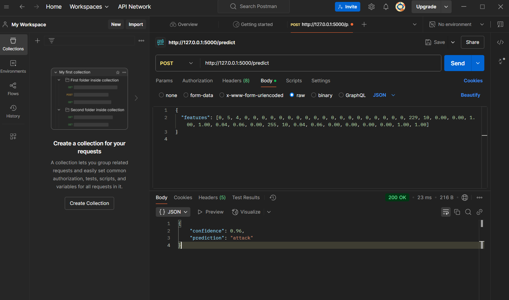
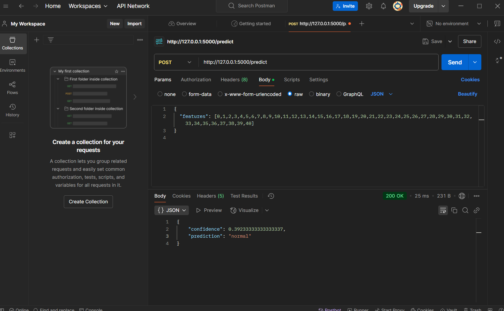
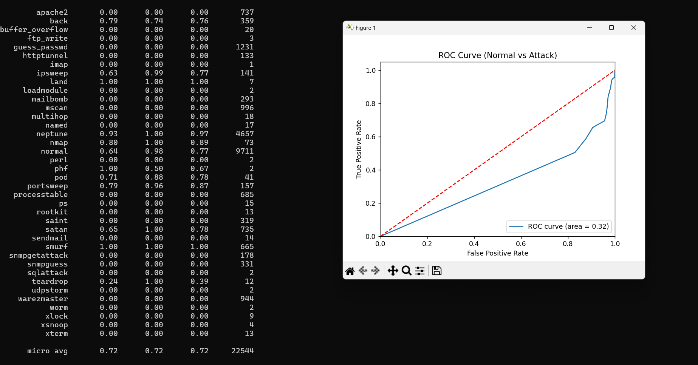

# IDS-ML-Project

## Overview
The **IDS-ML-Project** is a machine learning pipeline designed for network intrusion detection using the NSL-KDD dataset. The project uses a **Random Forest classifier** to detect different types of network attacks and serves predictions via a **Flask-based REST API**. Additionally, evaluation scripts are provided to generate a confusion matrix, classification report, and ROC curve to assess model performance.

## Project Structure
```
IDS-ML-Project/
├── data/
│   ├── KDDTrain+.txt       # Training dataset (NSL-KDD)
│   └── KDDTest+.txt        # Testing dataset (NSL-KDD)
├── models/
│   └── random_forest.joblib  # Saved Random Forest model
├── src/
│   ├── app.py              # Flask API to serve model predictions
│   ├── evaluate.py         # Script for model evaluation (confusion matrix, ROC, etc.)
│   ├── preprocess.py       # Module for loading and preprocessing NSL-KDD data
│   └── train.py            # Script to train the Random Forest model with SMOTE balancing
├── requirements.txt        # List of dependencies
└── README.md               # Project documentation (this file)
```

## Requirements
Install dependencies using:
```bash
pip install -r requirements.txt
```
Additionally, if you plan to use Postman for testing your API, download and install Postman.

## Detailed Description

### 1. preprocess.py
This module contains functions to load and preprocess the NSL-KDD dataset.

#### Key Functions:
- **`load_nsl_kdd(train_path, test_path)`**: Loads training and testing datasets into pandas DataFrames.
- **`rename_columns(df)`**: Renames columns, setting column 41 as "label" and column 42 as "difficulty".
- **`encode_categorical(df)`**: Encodes categorical columns (protocol_type, service, and flag) using LabelEncoder.
- **`split_dataset(df, test_size=0.2)`**: Splits the DataFrame into features (X) and target labels (y).

### 2. train.py
Trains a **Random Forest classifier** on the preprocessed NSL-KDD dataset and handles class imbalance using **SMOTE**.

#### Main Steps:
- Loads and preprocesses the dataset.
- Handles missing labels in the test set.
- Applies **Label Encoding** to categorical values.
- Uses **SMOTE** to balance class distributions.
- Trains a **Random Forest model** with `class_weight="balanced"`.
- Saves the trained model to `models/random_forest.joblib`.
- Tests the model on a real attack sample and prints predictions.

### 3. app.py
A **Flask API** to serve predictions from the trained model.

#### Key Features:
- **Endpoint `/predict`**: Accepts POST requests with a JSON payload containing numeric features.
- **Prediction Process**: Loads the trained model and returns a **prediction with confidence score**.

### 4. evaluate.py
Evaluates model performance using the **test dataset**.

#### Key Features:
- Computes **confusion matrix** and **classification report**.
- Ensures **label encoding consistency** between training and test sets.
- Computes and plots the **ROC curve** for binary classification.

#### Evaluation Results
##### Attack Detection Example:


##### Normal Traffic Example:


##### Classification Report and ROC Curve:


## Running the Project

### Training the Model
Ensure your NSL-KDD datasets (`KDDTrain+.txt` and `KDDTest+.txt`) are in the `data/` folder. Then run:
```bash
python train.py
```
This will preprocess the data, balance classes, train the model, and save it.

### Running the API
Start the Flask API by running:
```bash
python app.py
```
The API will run on `http://127.0.0.1:5000`.

#### Example Request
Use Postman or any HTTP client to send a **POST** request to `/predict` with a JSON payload:
```json
{
    "features": [/* list of 41 numeric feature values */]
}
```
The API will return a JSON response with the **prediction and confidence score**.

### Evaluating the Model
Run the evaluation script:
```bash
python evaluate.py
```
This will output **classification metrics** and plot the **ROC curve**.

## Additional Notes

### Preprocessing Consistency
Ensure that API inputs are preprocessed identically to the training data.

### Model Improvement
Experiment with different classifiers, adjust SMOTE parameters, or fine-tune **Random Forest** hyperparameters.

### Deployment
For production, use a **WSGI server** (e.g., Gunicorn) and add logging & monitoring.

---
This project provides a **robust foundation** for network intrusion detection using machine learning. Contributions and improvements are welcome!

